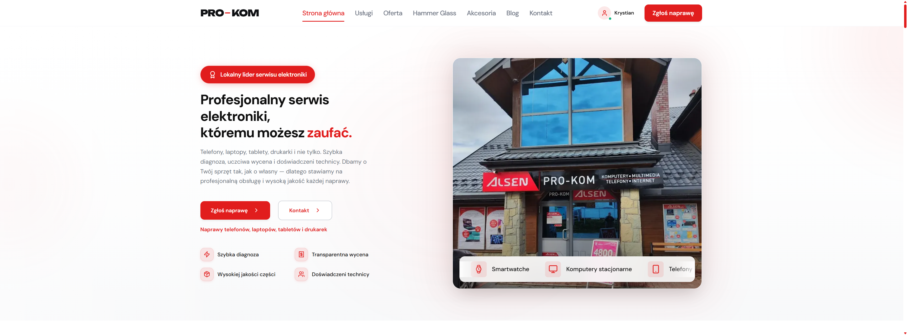
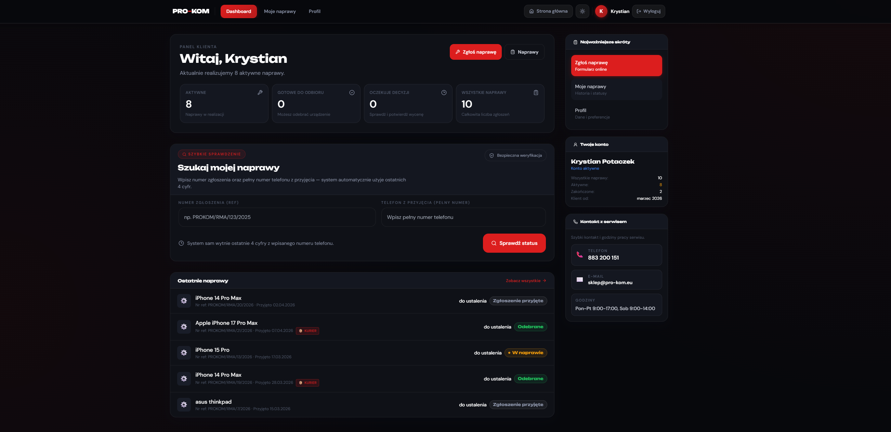
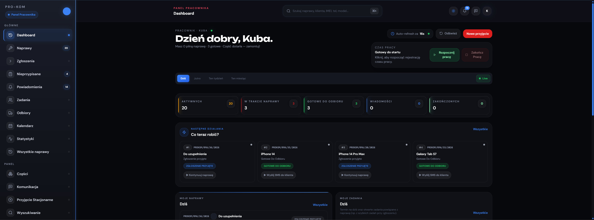
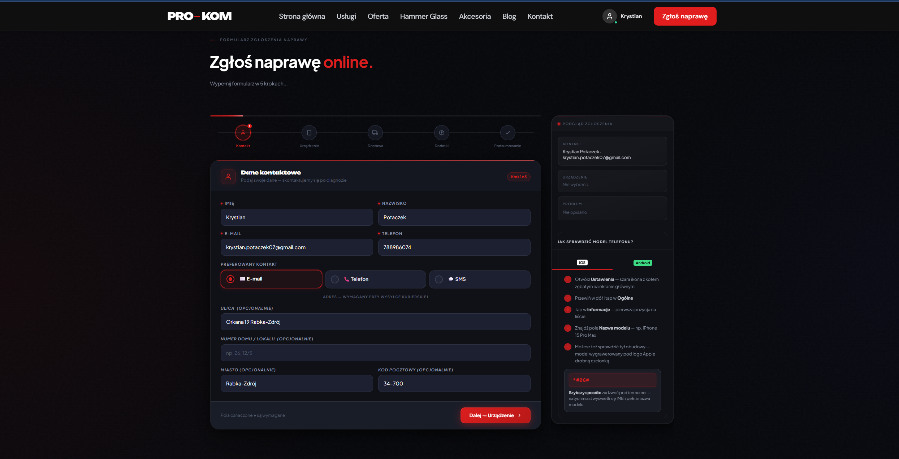
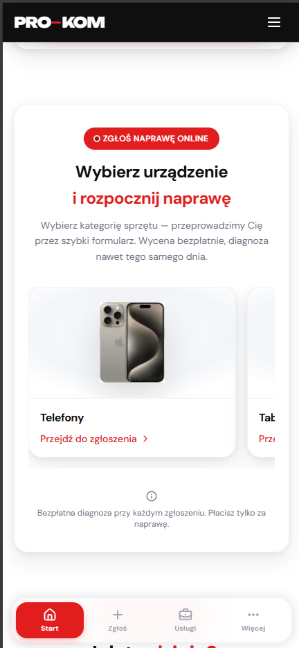
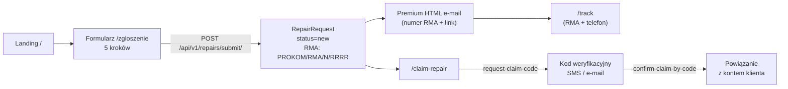
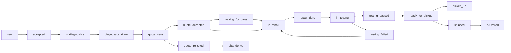
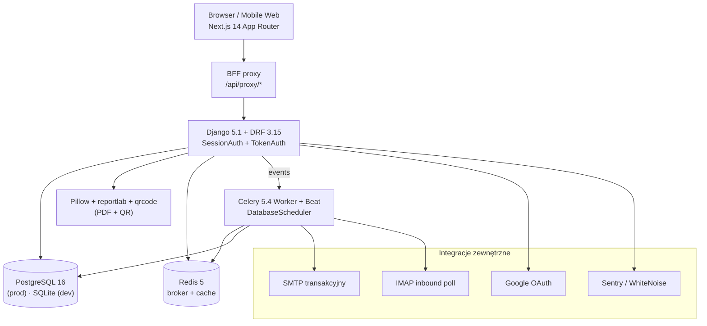

<div align="center">



# PRO-KOM Serwis

### Premium platforma operacyjna dla serwisu elektroniki

**Telefony • Laptopy • Tablety • Drukarki • Konsole • Smartwatche**

Workflow oparty na statusach. Transparentny tracking RMA. Produkcyjna architektura.

<br/>

[](#)
[]()
[]()
[]()

[]()
[]()
[]()
[]()
[]()
[]()
[]()
[]()

<br/>

**[⭐ Overview](#-executive-overview)** ·
**[💼 Biznes](#-biznes-i-produkt)** ·
**[🖼 Podgląd](#-podgląd-produktu)** ·
**[⚙️ Workflow](#%EF%B8%8F-jak-to-działa-end-to-end)** ·
**[🏗 Architektura](#-architektura-systemu)** ·
**[🧩 Funkcje](#-funkcjonalności-pełny-zakres)** ·
**[🔌 API](#-api--przegląd)** ·
**[🧰 Stack](#-stack-technologiczny)** ·
**[🚀 Quick Start](#-quick-start)** ·
**[🔐 Bezpieczeństwo](#-bezpieczeństwo-i-jakość)**

</div>

<br/>

---

## ⭐ Executive Overview

**PRO-KOM Serwis** to kompletna, produkcyjna platforma operacyjna dla serwisu elektroniki w Rabce-Zdroju, łącząca w jednym systemie cztery role i cztery interfejsy:

- 🌐 **Stronę publiczną** premium (SEO + 21 podstron + formularze)
- 👤 **Panel klienta** (tracking, akceptacja wycen, historia napraw)
- 🛠 **Panel pracownika** (workflow napraw, intake, kalendarz, części, komunikacja)
- 🧭 **Panel administratora** (KPI, workload, control center, RODO, feature flags)

System pokrywa **pełny cykl życia zlecenia** — od publicznego zgłoszenia internetowego, przez intake na recepcji, diagnostykę, wycenę, akceptację klienta, naprawę, testy, aż po odbiór, dostawę kurierem albo paczkomatem oraz ankietę satysfakcji. Architektura oparta jest o sprawdzony stack: **Django 5.1 + DRF 3.15** od strony API, **Next.js 14 App Router + TypeScript + Tailwind** po stronie UI, **Celery 5.4 + Redis** dla automatyzacji asynchronicznej i **PostgreSQL** w produkcji.

### 📊 Projekt w liczbach

| Metryka | Wartość | Skąd to wiemy |
|---|---|---|
| **Aplikacje Django** | **19** | `backend/apps/*` (`accounts`, `clients`, `devices`, `repairs`, `diagnostics`, `pricing`, `inventory`, `orders`, `tasks`, `availability`, `accessories`, `hammer_glass`, `communications`, `timelines`, `calendar_app`, `documents`, `analytics`, `compliance`, `search`, `common`) |
| **Statusy napraw** | **21** + 10 internal + 7 reklamacji | `backend/apps/common/enums.py` |
| **Priorytety** | **5** (`low`, `normal`, `high`, `urgent`, `same_day`) | `backend/apps/common/enums.py` |
| **Role użytkownika** | **3** (`admin` / `staff` / `client`) | `backend/apps/accounts/models.py::UserRole` |
| **Kategorie urządzeń** | **8** (phone / tablet / laptop / desktop / printer / console / smartwatch / other) | `backend/apps/devices/models.py` |
| **Strony publiczne (Next.js)** | **21** podstron | `frontend/app/(public)/*` |
| **Domeny API** | **19** prefiksów pod `/api/v1/` | `backend/config/urls.py` + `apps/*/urls.py` |
| **Zadania Celery** | **4** (smart reminders, notifications, backup, KPI snapshots) | `backend/apps/*/tasks.py` |
| **Kanały komunikacji** | **5** (email / sms / panel / phone / internal) | `apps/communications/models` |
| **Fonty Google na froncie** | **4** (Syne, DM Sans, Unbounded, Plus Jakarta Sans) | `frontend/app/layout.tsx` |
| **Rynek** | Polska (Małopolska, Rabka-Zdrój) | branding |
| **Waluta** | PLN | `pricing` + dokumenty PDF |

---

## 💼 Biznes i produkt

### Problem rynkowy

Lokalne serwisy elektroniki w Polsce zmagają się z trzema typowymi bolączkami:

1. **Rozproszony workflow** — naprawy żyją w głowach pracowników, w kartkach na biurku albo w kilku różnych narzędziach (Excel + Messenger + e-mail + ręczne SMS-y).
2. **Brak transparentności dla klienta** — klient po oddaniu telefonu „znika w czarnej dziurze" i co kilka dni dzwoni z pytaniem *„kiedy będzie gotowe?"*.
3. **Brak danych dla właściciela** — żadnych KPI, żadnych snapshotów obciążenia zespołu, żadnego widoku „co najbardziej psuje terminy".

### Co rozwiązuje PRO-KOM

| Dla kogo | Co dostaje | Jak to wygląda w systemie |
|---|---|---|
| 👤 **Klient** | Tracking RMA bez konta, akceptacja wyceny online, claim reklamacji z kodem SMS, panel z historią | `app/(public)/track`, `app/(public)/claim-repair`, `app/client/dashboard` |
| 🛠 **Pracownik** | Workflow oparty na 21 statusach, smart reminders, sugerowane wiadomości, lista nieprzypisanych, kalendarz, części | `app/panel/*` (~25 podstron) |
| 🧭 **Właściciel** | Dashboard KPI, **WorkloadChart**, statystyki, ranking pracowników, **Control Center** (system settings + feature flags + audyt) | `app/admin-panel/*` (~20 podstron) |
| 🤖 **System** | Smart reminders, notyfikacje event-driven, dzienne snapshoty KPI, automatyczne backupy | Celery Worker + Beat |

### Kluczowe przewagi konkurencyjne

- 🧬 **21-stopniowy workflow** odpowiadający rzeczywistemu cyklowi życia zlecenia (nie 3 statusy „w toku / gotowe / oddane")
- 📜 **RODO ready** — `django-simple-history` audyt, GDPR export, anonimizacja, wersjonowanie regulaminów (`TermsVersion`)
- 📨 **Inbound e-mail** (webhook + IMAP polling) — odpowiedzi klientów wracają wprost do panelu, do wątku konkretnej naprawy
- ⚡ **Smart automatyzacje** — przypomnienia o nieakceptowanej wycenie, nieodebranym sprzęcie, niedokończonym intake, ankieta satysfakcji
- 🎨 **Premium UI** — dark/light theme bez FOUC, 4 fonty Google, premium komponenty (PremiumButton, PremiumCard, WorkloadChart, DatePickerInput)
- 🛡 **Produkcyjny security baseline** — anti brute-force, throttling DRF, OTP weryfikacja e-mail, blokady kont, audyt konfiguracji
- 🔧 **Hammer Glass + Akcesoria** — wbudowany system upselli per naprawa, z tracking interest i ofertami sprzedażowymi
- 🧭 **Control Center** dla admina — zmiana ustawień systemu, feature flags i pełny audit log w UI, bez deploya

---

## 🖼 Podgląd produktu

|  |  |
|---|---|
| **🌐 Strona publiczna** — landing premium z hero, ofertą i CTA do zgłoszenia | **👤 Panel klienta** — KPI, lista napraw, akceptacja wycen, profil |

|  |  |
|---|---|
| **🛠 Panel pracownika** — dashboard ze ScopeBar, kolejka pracy, sugestie | **📝 Formularz zgłoszenia** — 5 kroków: kontakt → urządzenie → dostawa → akcesoria → potwierdzenie |

<br/>

<p align="center">
  
</p>

> 📱 **Pełna responsywność.** Formularz zgłoszenia, panel klienta i strona publiczna działają natywnie na mobile po **mobile-first refactor** z kwietnia 2026 (premium navigation, dotykowe gesty, optymalizacja scrolla).

---

## ⚙️ Jak to działa end-to-end

### 1) 🚪 Ścieżka gościa — zgłoszenie, tracking, reklamacja



1. Klient wchodzi na `/zgloszenie` (publiczna trasa Next.js).
2. Wypełnia **5-krokowy formularz**: kontakt → urządzenie → metoda dostawy → akcesoria → podsumowanie.
3. `POST /api/v1/repairs/submit/` tworzy `RepairRequest` ze statusem `new` i generuje numer RMA `PROKOM/RMA/N/RRRR`.
4. Klient dostaje **premium HTML e-mail** z numerem RMA i linkiem do śledzenia.
5. Śledzi naprawę przez `/track` (RMA + telefon) — bez konta — albo loguje się do panelu klienta.
6. Reklamacja: `/claim-repair` → `POST /repairs/request-claim-code/` → kod SMS/e-mail → `POST /repairs/confirm-claim-by-code/` → naprawa przepisana jako `complaint`.

### 2) 🛠 Ścieżka pracownika — pełny workflow napraw

Workflow statusów (główna ścieżka, z odgałęzieniami testów i odrzucenia wyceny):



W panelu pracownika dostępne są dodatkowo:

- **Quick actions** — `quick-accept` (przyjęcie jednym klikiem), `quick-complaint-warranty` (przyjęcie reklamacji)
- **Special views** — `requires-action`, `unclaimed-devices`, `requires-decision`
- **Smart suggestions** — `suggest-assignment` (komu przypisać naprawę), sugerowane następne statusy, sugerowane wiadomości
- **Timeline** napraw z filtrowaniem typów eventów i widocznością wątków klient / staff / team
- **Checklist** per naprawa, **części** z PartUsage, **cost summary** w czasie rzeczywistym

### 3) 🧭 Ścieżka administratora

- **Dashboard KPI** (`/admin-panel/dashboard`) — agregacja `analytics.kpi`, `staff-kpi`, `summary`, `health-overview`
- **WorkloadChart** — premium chart pokazujący aktywne naprawy per technik (`/admin-panel/workload`, kwiecień 2026)
- **Bulk assign** napraw przez `AdminAssignRepairsModal`
- **Premium master calendar** — kalendarz całego zespołu z dostępnością i nieobecnościami
- **Control Center** — `SystemSetting` + `FeatureFlag` + `ConfigAuditLog` z poziomu UI
- **Team management** — zarządzanie pracownikami, blokady kont, wymuszenie zmiany hasła, akceptacja `EmployeeAbsenceRequest`

### 4) 🤖 Ścieżka asynchroniczna (Celery)

| Zadanie | Typ | Co robi |
|---|---|---|
| `repairs.send_smart_reminders` | Periodic (Beat) | Brak akceptacji wyceny >24h, sprzęt nieodebrany >3 dni, dzisiejsza wizyta klienta, niedokończony intake >2h |
| `communications.send_notification_for_repair_event` | Event-driven | Silnik reguł `NotificationRule` — wysyłka e-mail/SMS na zmianę statusu, akceptację wyceny, gotowość do odbioru |
| `compliance.run_backup` | On-demand / Beat | Backup `database` / `media` / `full` z logiem do `BackupLog` |
| `analytics.build_employee_stats_snapshots` | Periodic (Beat, dziennie) | Agregacja KPI staff do `EmployeeStatsSnapshot` |

---

## 🏗 Architektura systemu

### Warstwy i przepływ



### Tabela warstw

| Warstwa | Technologia | Odpowiedzialność |
|---|---|---|
| **Frontend** | Next.js 14.2 App Router, React 18, TS 5, Tailwind 3.4, TanStack Query 5, Zustand 5 | SSR/CSR, BFF proxy `/api/proxy/*`, sessionStorage auth, dark/light theme bez FOUC |
| **API** | Django 5.1, DRF 3.15, drf-spectacular 0.27 | Endpointy REST, auth (Token + Session), permissions, throttling, Swagger |
| **Async** | Celery 5.4 + django-celery-beat 2.7 | Smart reminders, notification rules, backupy, KPI snapshots |
| **Data** | PostgreSQL 16 (prod) / SQLite (dev) + Redis 5 | Persystencja + cache + Celery broker |
| **Documents** | reportlab 4.2, qrcode 7.4, Pillow 10.4 | Protokoły PDF, etykiety, QR codes per naprawa |
| **Integracje** | SMTP, Google OAuth, IMAP, inbound webhook | Transakcyjne maile, OAuth login, dwustronna komunikacja klient↔serwis |
| **Observability** | Sentry, WhiteNoise, `django-simple-history` | Monitoring błędów, statyki w prod, audyt zmian modeli |

### Drzewo monorepo

<details>
<summary><b>Pełna struktura projektu</b> (kliknij, aby rozwinąć)</summary>

```
prokom-system/
├── backend/                          # Django 5.1 + DRF 3.15
│   ├── config/
│   │   ├── settings/                 # base.py, local.py, prod.py, render.py
│   │   ├── urls.py                   # mapowanie /api/v1/* na 19 aplikacji
│   │   └── celery.py                 # konfiguracja Celery + DatabaseScheduler
│   ├── apps/
│   │   ├── common/                   # bazowe modele, enumy, audit log
│   │   ├── accounts/                 # User, role, OTP, anti-bruteforce, Google OAuth
│   │   ├── clients/                  # profile klientów, zgody, notatki, adresy
│   │   ├── devices/                  # marki, modele, urządzenia klienta, zdjęcia
│   │   ├── repairs/                  # core napraw — 21 statusów, timeline, claim
│   │   ├── diagnostics/              # raporty diagnostyczne
│   │   ├── pricing/                  # Quote, QuoteItem, QuoteVersion, Deposit, LabourType
│   │   ├── inventory/                # Supplier, Part, PurchaseOrder, PartUsage
│   │   ├── orders/                   # zamówienia klienta + zaopatrzeniowe
│   │   ├── tasks/                    # zadania wewnętrzne + komentarze
│   │   ├── availability/             # availability + absence + WorkSession
│   │   ├── accessories/              # akcesoria + bundle + offers
│   │   ├── hammer_glass/             # folie ochronne + offers
│   │   ├── communications/           # templates, logs, rules, inbound
│   │   ├── timelines/                # placeholder (logika w repairs)
│   │   ├── calendar_app/             # CalendarEvent, TimeslotBlock
│   │   ├── documents/                # PDF + QR
│   │   ├── analytics/                # KPI + staff snapshots
│   │   ├── compliance/               # GDPR + Terms + Backup + SystemSetting + FeatureFlag
│   │   └── search/                   # global / intake / advanced
│   ├── tests/                        # pytest integracyjne
│   ├── manage.py
│   ├── requirements.txt
│   └── .env.example
├── frontend/                         # Next.js 14.2 App Router
│   ├── app/
│   │   ├── (public)/                 # 21 podstron publicznych
│   │   ├── client/                   # panel klienta (login, dashboard, naprawy, profil)
│   │   ├── panel/                    # panel pracownika (~25 podstron PL + EN aliasy)
│   │   ├── admin-panel/              # panel admina (~20 podstron EN)
│   │   ├── layout.tsx                # 4 fonty Google, theme init script
│   │   └── globals.css               # design tokens, dark/light theme
│   ├── components/
│   │   ├── ui/                       # Button, Card, Skeleton, Toast, ConfirmDialog, ...
│   │   ├── panel/                    # Sidebar, Topbar, modale, AdminTasksWorkspace
│   │   ├── repairs/                  # RepairStatusBadge, NextActionBadge, ...
│   │   ├── layout/                   # PublicNavbar, ConditionalPublicLayout
│   │   ├── providers/                # QueryProvider, ClientAuthWrapper
│   │   └── hammer-glass/             # sekcje landing page Hammer Glass
│   ├── features/                     # client-dashboard, client-naprawy, client-profil
│   ├── lib/                          # api.ts, auth-storage.ts, queryClient.ts, theme.ts
│   ├── store/                        # Zustand global store
│   ├── hooks/                        # useAutoRefresh, useClientProfile
│   ├── contexts/                     # AuthContext (login, staffLogin, register, ...)
│   ├── types/                        # TypeScript domain types
│   ├── tailwind.config.ts            # paleta prokom + accent + animacje
│   ├── next.config.js                # rewrites, redirects, headers, CSP
│   └── package.json
├── docs/                             # dokumentacja modułów + screenshoty
├── docker/                           # Dockerfile + compose
├── .github/workflows/                # backend-ci.yml + frontend-ci.yml
├── SCENARIUSZE_UZYTKOWNIKOW.md       # ✅ aktualne scenariusze
├── PROKOM_DOKUMENTACJA_FRONTEND.md   # ✅ aktualna doc frontendu
├── RAPORT_TESTOW_PRE_PRODUKCJA.md    # ✅ status pre-produkcji
└── README.md                         # ⬅ ten plik
```

</details>

---

## 🧩 Funkcjonalności (pełny zakres)

### 🔐 Auth & Accounts (`apps.accounts`)

- Rejestracja klienta z **OTP weryfikacją e-mail** (`EmailVerificationCode`, blokada po 5 błędnych próbach × 15 min)
- Logowanie klient + osobne `staff-login` z `must_change_password`
- **Google OAuth** (`POST /accounts/auth/google`) — pełna integracja `@react-oauth/google`
- Anti brute-force: `LoginFailureLog` (≥10 fail z IP / 15 min → 429; ≥20 fail/konto / 15 min → konto wyłączone + e-mail powiadomienie)
- Reset hasła z `PasswordResetToken` (1h, jednorazowy, tracking użycia)
- Role: `admin` / `staff` / `client` (pole `User.role`)
- Staff notifications, recovery account `is_superadmin`, audit `LoginActivity`

### 🌐 Strona publiczna (`frontend/app/(public)/`)

21 podstron z pełnym SEO, sitemap.ts i robots.ts:

`/` (landing premium) · `/oferta` · `/uslugi` · `/kontakt` · `/faq` · `/regulamin` · `/polityka-prywatnosci` · `/obslugiwane-miejscowosci` · `/blog` + `/blog/[slug]` · `/track` · `/claim-repair` · `/zgloszenie` (5-krokowy formularz) · `/hammer-glass` · `/akcesoria` · `/serwis-laptopow` · `/serwis-komputerow` · `/serwis-konsol` · `/serwis-drukarek` · `/serwis-tabletow` · `/serwis-smartwatchy` · `/odzyskiwanie-danych`

### 👤 Panel klienta (`frontend/app/client/`)

- Dashboard z KPI: aktywne naprawy, oczekujące akcje, ankieta satysfakcji
- Lista napraw + szczegóły (`/client/naprawy/[id]`) z timeline i wątkiem wiadomości
- Akceptacja / odrzucenie wyceny online (`POST /repairs/{id}/quote-respond/`)
- Profil + zarządzanie zgodami RODO + eksport danych (`/compliance/export-my-data/`)
- Wnioskowanie o usunięcie konta (`/compliance/request-account-deletion/`)
- Verify-email, forgot-password, reset-password, rejestracja

### 🛠 Panel pracownika (`frontend/app/panel/`)

~25 podstron — dominują polskie nazwy z EN aliasami:

- `/panel/dashboard` — ScopeBar (today / tomorrow / week / month), kolejka pracy
- `/panel/intake` — 5-krokowy intake recepcyjny + `IntakePreviewPanel`
- `/panel/repairs` (alias `/panel/naprawy`) — lista + filtry + bulk select
- `/panel/repairs/[id]` — pełen widok naprawy z `RepairTasksPanel`, `RepairPartsSection`, `RepairCourierTab`
- `/panel/zgloszenia` — nieprzypisane zgłoszenia z sugestią assignment
- `/panel/kalendarz` (alias `/panel/calendar`) — premium kalendarz
- `/panel/zadania` (alias `/panel/tasks`) — Task + TaskComment
- `/panel/czesci-hurtownie` (alias `/panel/parts`) — magazyn + zamówienia + autocomplete
- `/panel/komunikacja` (alias `/panel/comm`) — szablony + logi + inbound
- `/panel/reklamacje-gwarancje/przyjecie` — quick complaint/warranty intake
- `/panel/dostepnosc` (alias `/panel/availability`) — availability + absence requests + work-sessions/me
- `/panel/wyszukiwanie` (alias `/panel/search`) — `AdvancedSearchPanel`
- `/panel/powiadomienia` (alias `/panel/notif`) — staff notifications + inbox
- `/panel/klienci` — CRM lista + szczegóły + edycja
- `/panel/archive` · `/panel/historia` · `/panel/zespol` · `/panel/zamowienia` · `/panel/konfiguracja`

### 🧭 Panel admina (`frontend/app/admin-panel/`)

~20 podstron — głównie EN nazwy:

- `/admin-panel/dashboard` — KPI + health overview + admin-dashboard
- `/admin-panel/repairs` — globalna lista wszystkich napraw
- `/admin-panel/calendar` — premium master calendar
- `/admin-panel/workload` — **WorkloadChart** (aktywne naprawy per technik)
- `/admin-panel/stats` — `staff-ranking`, `repairs-report`, `manager-view`, `health-score`
- `/admin-panel/clients` + `/admin-panel/clients/[id]` + `/edit` — pełny CRM
- `/admin-panel/parts` · `/admin-panel/hurtownie` · `/admin-panel/orders`
- `/admin-panel/notif` + `/notif/[id]` — admin notifications
- `/admin-panel/claims` — kolejka reklamacji
- `/admin-panel/pickups` — pickup panel (gotowe do odbioru)
- `/admin-panel/search` · `/admin-panel/archive` · `/admin-panel/comm`
- `/admin-panel/team` (wrap `panel/zespol`) · `/admin-panel/availability` · `/admin-panel/intake` · `/admin-panel/config` (Control Center)

### 🧬 Naprawy (`apps.repairs`)

- **21 statusów** + 10 `InternalRepairStatus` + 7 `ComplaintWarrantyStatus`
- **5 priorytetów** (`low`, `normal`, `high`, `urgent`, `same_day`)
- 3 metody dostawy + 3 metody zwrotu (in_person / courier / parcel_locker)
- Timeline + `RepairStatusHistory` + `RepairAssignment` + `RepairImage`
- Wątek wiadomości: client thread / staff thread / team thread (`TeamThreadMessage`)
- Notatki: client / internal / team
- **Checklist** per naprawa + **PartUsage** z statusem ordered/arrived/used/unused
- **Courier tracking fields** (`client_tracking_number`, `inbound_tracking_number`)
- **`RepairClaimSmsCode`** — kod SMS do claim'u naprawy
- **`SatisfactionSurvey`** — ankieta po zakończeniu
- **`RepairVisitSchedule`** — umówiona wizyta klienta
- Smart suggestions: `suggest-assignment`, sugerowane następne statusy
- Cost summary w czasie rzeczywistym

### 💰 Wyceny i zaliczki (`apps.pricing`)

- `Quote` z statusami `draft|sent|accepted|rejected|expired` + `valid_until`
- `QuoteItem` (typ `part|labour|other`) z `unit_price` + `total`
- `QuoteVersion` — snapshot historii zmian wyceny
- `QuoteDecision` — decyzja klienta (akceptacja / odrzucenie z opisem)
- `Deposit` — zaliczki powiązane z naprawą
- `LabourType` — cennik robocizny z `default_price` i `estimated_minutes`
- `last_client_email_sent_at` na Quote — anti-spam ponawiania wysyłek

### 📦 Inwentarz i części (`apps.inventory`)

- `Supplier` z NIP, URL, `average_delivery_days`
- `Part` z polami kompatybilności (device_category, brand, device_model_name, part_type, quality_variant)
- `PurchaseOrder` z statusami `draft|sent|confirmed|partially_received|received|cancelled`
- `PartUsage` — most część↔naprawa, z `custom_part_name` (świeże, kwiecień 2026), statusy queue `to_order|ordered|arrived|delayed`, blocking flags
- Parts queue dashboard, parts autocomplete, part card view
- `parts-dashboard-summary` z agregacją

### 🛒 Zamówienia (`apps.orders`)

- `OrderProductCategory`, `OrderProduct` — katalog
- `CustomerOrder` — zamówienia klienta
- `StoreSupplyOrder` — zamówienia zaopatrzeniowe
- Dashboard zamówień + `to-order-today` + `by-supplier`

### 📋 Zadania (`apps.tasks`)

- `Task` + `TaskComment`
- `AdminTasksWorkspace` — premium workspace dla admina
- Suggestions API (`tests/test_suggestions.py`)

### 📅 Dostępność i sesje pracy (`apps.availability`)

- `EmployeeAvailability` — grafik dostępności
- `EmployeeAbsenceRequest` (kwiecień 2026) — wnioski o nieobecność z workflow akceptacji
- **`WorkSession`** (kwiecień 2026) — sesje pracy z `start_at`, `end_at`, agregacja miesięczna
- `work-sessions/me/*` (pracownik) + `work-sessions/admin/month-summary` (admin)

### 📨 Komunikacja (`apps.communications`)

- 5 kanałów: `email` (SMTP), `sms` (stub), `panel`, `phone`, `internal`
- `MessageTemplate` z placeholderami: `{{repair_number}}`, `{{client_name}}`, `{{status}}`, ...
- `CommunicationLog` — snapshot treści, recipient, status sent/failed, błąd
- `NotificationRule` — event-driven, odpalane przez Celery na zmianę statusu
- **Inbound e-mail**: webhook (`/communications/inbound-email`, `X-Inbound-Secret`) + IMAP polling (`poll_inbound_imap` command)
- **Premium HTML email templates** (kwiecień 2026)
- Public inquiry form (`/communications/inquiry/`) z anti-spam

### 📄 Dokumenty (`apps.documents`)

- **Protokół przyjęcia A4** (`/repair/{id}/acceptance-protocol`)
- Skrócony protokół (`/acceptance-protocol-short`)
- **Reklamacja / gwarancja intake** (`/complaint-warranty-intake`)
- **QR code** per naprawa (`/repair/{id}/qr` PNG)
- Branded `SERWIS_PRINT_*` + `FRONTEND_BASE_URL` w PDF-ach

### 🔧 Hammer Glass + Akcesoria (`apps.hammer_glass`, `apps.accessories`)

- **Hammer Glass**: `HammerGlassFilmType`, `HammerGlassProduct`, `RepairHammerGlassOffer`
- **Akcesoria**: `AccessoryCategory`, `AccessoryProduct`, `AccessoryBundle`, `AccessoryBundleItem`
- `RepairAccessoryInterest` — tracking zainteresowania klienta
- `RepairAccessoryOffer` — oferty sprzedażowe per naprawa
- Recommended products endpoint (`/repairs/{id}/recommended-products/`)

### 📜 Compliance Center (`apps.compliance`)

- **GDPR**: `GdprRequest` (export/deletion z workflow statusów)
- **Terms**: `TermsVersion` (wersjonowanie regulaminów + akceptacje)
- **Backup**: `BackupLog` (status `database` / `media` / `full` backupów)
- **Control Center**:
  - `SystemSetting` — globalne ustawienia z UI
  - `FeatureFlag` — przełączniki funkcji bez deploya
  - `ConfigAuditLog` — pełny audit zmian configu
- Eksport danych: `GET /compliance/export-my-data/` (JSON: user + client + devices + repairs + consents)
- Wnioskowanie o usunięcie: `POST /compliance/request-account-deletion/`

### 📅 Kalendarz (`apps.calendar_app`)

- `CalendarEvent` — eventy zespołu
- `TimeslotBlock` — bloki niedostępności
- `GET /calendar/month/` — agregacja miesięczna z dostępnością + nieobecnościami

### 🔍 Wyszukiwanie (`apps.search`)

- **Global**: multi-entity search (Client + RepairRequest + Device), min 2 znaki, limity 15/30
- **Intake**: wyszukiwanie klientów do flow przyjęcia + lista urządzeń klienta
- **Advanced**: filtry `type`, `status`, `repair_type`, `assigned_to`, `source`, `client_type`, `date_from`, `date_to`

### 📈 Analytics (`apps.analytics`)

- KPI: aktywne naprawy, średni czas, satysfakcja, on-time %
- Staff KPI + ranking + manager view
- Repairs report z agregacją po statusach i typach
- Health overview + health score (kondycja serwisu)
- `EmployeeStatsSnapshot` — dzienne snapshoty z Celery
- Admin dashboard endpoint

---

## 🔌 API — przegląd

- **Prefix**: `/api/v1/`
- **Swagger UI**: `http://localhost:8000/api/docs/`
- **ReDoc**: `http://localhost:8000/api/redoc/`
- **OpenAPI schema**: `/api/schema/` (DEBUG only)

### Domeny endpointów

| Prefix | Dostęp | Najważniejsze endpointy |
|---|---|---|
| `accounts/` | mix | `login`, `staff-login`, `register`, `verify-email`, `resend-verification-code`, `request-password-reset`, `reset-password`, `change-password`, `me`, `logout`, `auth/google`, `notifications/*`, `staff/*` |
| `clients/` | staff/admin | CRUD klientów + `me` (klient) |
| `devices/` | mix | `brands`, `models`, `devices` (CRUD) |
| `repairs/` | mix | **public**: `submit`, `track`, `claim`, `request-claim-code`, `confirm-claim-by-code` · **staff**: `quick-accept`, `quick-complaint-warranty`, `dashboard`, `pickup-panel`, `{id}/change-status`, `{id}/timeline`, `{id}/messages`, `{id}/checklist`, `{id}/parts`, `{id}/cost-summary`, `{id}/quote-respond`, `{id}/satisfaction-survey`, `{id}/recommended-products`, `{id}/mark-package-received`, `{id}/set-inbound-tracking`, `special-views/*` |
| `pricing/` | staff | `quotes`, `quote-items`, `deposits`, `labour-types` |
| `inventory/` | staff | `suppliers`, `parts`, `parts-queue`, `purchase-orders`, `parts-dashboard-summary`, `parts/autocomplete`, `parts/{id}/card` |
| `orders/` | staff | `categories`, `products`, `customer-orders`, `store-supply`, `dashboard`, `to-order-today`, `by-supplier` |
| `tasks/` | staff | CRUD + suggestions |
| `availability/` | mix | `availability`, `absence-requests`, `work-sessions/me/*`, `work-sessions/admin/month-summary` |
| `accessories/` | mix | `categories`, `products`, `bundles`, `repair-offers` |
| `hammer-glass/` | mix | `film-types`, `products`, `repair-offers` |
| `communications/` | mix | `templates`, `logs`, `send`, `inbound-email` (webhook), `inquiry` (public) |
| `calendar/` | staff | `month` |
| `documents/` | staff | `acceptance-protocol`, `acceptance-protocol-short`, `complaint-warranty-intake`, `qr` |
| `analytics/` | staff/admin | `kpi`, `staff-kpi`, `staff-ranking`, `repairs-report`, `summary`, `health-overview`, `admin-dashboard`, `manager-view`, `health-score`, `staff/{user_id}/snapshots` |
| `compliance/` | mix | **client**: `export-my-data`, `request-account-deletion` · **admin**: `terms-versions`, `gdpr-requests`, `backup-logs`, `system-settings`, `feature-flags`, `config-audit-logs` |
| `search/` | staff | `global`, `intake`, `advanced` |
| `staff/repairs/` | staff | osobny widok listy/szczegółu napraw + `staff/dashboard/` |
| `config/` | public | `parcel-locker-address` |

### Standardy API

- **Auth**: `Authorization: Token <token>` w headerze albo Session
- **Throttling DRF** (kwiecień 2026):
  - `login` — 5/min
  - `register` — 3/min
  - `inquiry` (public) — 5/min
  - `repairs/submit` (public) — rate-limited
- **Pagination**: DRF page-based, `?page_size=20`
- **Filtry**: `?status=`, `?search=`, `?assigned_to=`, `?date_from=`, `?date_to=`
- **PK**: UUID (większość modeli)
- **Soft delete** (`SoftDeleteModel`)
- **Audyt zmian**: `django-simple-history` na kluczowych modelach

---

## 🧰 Stack technologiczny

### Backend (`backend/requirements.txt`)

| Komponent | Wersja | Po co |
|---|---|---|
| **Python** | 3.12+ (CI: 3.12) | Język |
| **Django** | 5.1.x | Framework |
| **DRF** | 3.15.x | REST API |
| **drf-spectacular** | 0.27.x | Swagger / OpenAPI |
| **PostgreSQL (psycopg)** | 3.2.x | DB w produkcji |
| **dj-database-url** | 2.2.x | Parsowanie `DATABASE_URL` |
| **Celery** | 5.4.x | Async tasks |
| **django-celery-beat** | 2.7.x | Periodic scheduler (DB) |
| **Redis** | 5.2.x | Broker + cache |
| **reportlab** | 4.2.x | PDF generation |
| **qrcode + Pillow** | 7.4.x / 10.4.x | QR + obrazy |
| **django-simple-history** | 3.7.x | Audyt zmian |
| **django-cors-headers** | 4.4.x | CORS |
| **django-filter** | 24.3.x | Filtry DRF |
| **WhiteNoise** | 6.7.x | Statyki w prod |
| **httpx** | 0.27.x | HTTP klient (integracje) |
| **cryptography** | 43.x | Szyfrowanie |
| **pytest + pytest-django** | 8.3 / 4.9 | Testy |
| **coverage** | 7.6.x | Pokrycie kodu |

### Frontend (`frontend/package.json`)

| Komponent | Wersja | Po co |
|---|---|---|
| **Next.js** | 14.2.18 | App Router, SSR/CSR |
| **React** | 18.3.1 | UI |
| **TypeScript** | 5.6.x | Typy |
| **Tailwind CSS** | 3.4.15 | Styling |
| **TanStack Query** | 5.91.x | Data fetching |
| **Zustand** | 5.0.12 | Global state |
| **Framer Motion** | 11.11.x | Animacje |
| **lucide-react** | 0.460.x | Ikony |
| **react-day-picker** | 9.14.x | Date picker |
| **date-fns** | 4.1.x | Daty |
| **@react-oauth/google** | 0.13.5 | Google OAuth |

### Infra & DevEx

| Element | Co używamy |
|---|---|
| **Hosting** | Render (`backend/config/settings/render.py` + `prod.py`) |
| **CI/CD** | GitHub Actions — `backend-ci.yml` (pytest, Python 3.12), `frontend-ci.yml` (npm build, Node 20) |
| **Branch strategy** | `master` (default), `develop`, `feature/*`, `fix/*`, `hotfix/*` |
| **Env config** | `backend/.env.example`, `frontend/.env.local.example` |
| **Monitoring** | Sentry (production-ready) |
| **Statyki** | WhiteNoise (Django) + Next.js standalone build |

### Integracje zewnętrzne

- **SMTP transakcyjny** — `EMAIL_HOST_*`
- **Google OAuth** — `POST /accounts/auth/google/`
- **Inbound e-mail** — webhook (`X-Inbound-Secret`) lub IMAP polling
- **Render managed PostgreSQL** — `DATABASE_URL`
- **Frontend BFF** — `/api/proxy/*` rewrite

---

## 🚀 Quick Start

### Wymagania

- **Python 3.12+**
- **Node 20+**
- **Redis** (opcjonalnie do Celery)
- **PostgreSQL** (opcjonalnie — domyślnie SQLite w dev)

### Backend

```bash
cd backend
python -m venv venv
venv\Scripts\activate                  # Windows (PowerShell: venv\Scripts\Activate.ps1)
# source venv/bin/activate             # macOS / Linux

pip install -r requirements.txt
copy .env.example .env                 # cp na macOS/Linux

python manage.py migrate
python manage.py createsuperuser

python manage.py seed_initial          # konta startowe + słowniki
python manage.py seed_staff_profiles   # profile staff + specjalizacje
python manage.py seed_message_templates  # szablony wiadomości
python manage.py seed_prokom_products  # Hammer Glass + akcesoria
python manage.py seed_sample_tasks     # demo taski (opcjonalnie)

python manage.py runserver
```

### Frontend

```bash
cd frontend
npm install
copy .env.local.example .env.local
npm run dev
```

### Celery (opcjonalnie — automatyzacja)

```bash
cd backend
celery -A config worker -l info
celery -A config beat -l info --scheduler django_celery_beat.schedulers:DatabaseScheduler
```

> 📖 Szczegóły: [docs/CELERY_URUCHOMIENIE.md](docs/CELERY_URUCHOMIENIE.md)

### Po starcie

| Usługa | URL |
|---|---|
| **Frontend** | <http://localhost:3000> |
| **API** | <http://localhost:8000> |
| **Swagger UI** | <http://localhost:8000/api/docs/> |
| **ReDoc** | <http://localhost:8000/api/redoc/> |
| **Django Admin** | <http://localhost:8000/admin/> |

### Kluczowe zmienne środowiskowe

| Zmienna | Po co |
|---|---|
| `SECRET_KEY` | Django secret |
| `DJANGO_SETTINGS_MODULE` | `config.settings.local` / `prod` / `render` |
| `DATABASE_URL` | PostgreSQL w prod (Render) |
| `ALLOWED_HOSTS` | Lista hostów |
| `EMAIL_HOST`, `EMAIL_HOST_USER`, `EMAIL_HOST_PASSWORD`, `DEFAULT_FROM_EMAIL` | SMTP transakcyjny |
| `EMAIL_INBOUND_WEBHOOK_SECRET` | Inbound webhook |
| `INBOUND_IMAP_*` | IMAP polling (opcjonalne) |
| `CELERY_BROKER_URL`, `CELERY_RESULT_BACKEND` | Redis URLe |
| `FRONTEND_BASE_URL` | Linki w mailach + PDF |
| `SERWIS_PRINT_*` | Branding na dokumentach |
| `PARCEL_LOCKER_ADDRESS` | Adres paczkomatu (publiczny) |
| `NEXT_PUBLIC_API_URL` | Frontend → backend |

---

## 🔐 Bezpieczeństwo i jakość

| Obszar | Realizacja |
|---|---|
| **Authentication** | Token + Session, `IsAuthenticated` default w DRF |
| **OTP weryfikacja e-mail** | `EmailVerificationCode` + 5-błędna blokada × 15 min |
| **Anti brute-force** | `LoginFailureLog`: ≥10 fail z IP / 15 min → 429 · ≥20 fail / konto / 15 min → konto wyłączone + e-mail |
| **Throttling DRF** | login (5/min), register (3/min), inquiry (5/min), public submit (rate-limited) — kwiecień 2026 |
| **Reset hasła** | `PasswordResetToken` (1h, jednorazowy, tracking użycia) |
| **Soft delete** | `SoftDeleteModel` na kluczowych modelach |
| **UUID PK** | Większość modeli — ochrona przed enumeracją |
| **Audyt zmian** | `django-simple-history` |
| **MIME validation** | Pillow na uploadach obrazów |
| **CSP** | Report-Only w `next.config.js` |
| **Nagłówki** | X-Frame-Options DENY, X-Content-Type-Options nosniff, Permissions-Policy, Referrer-Policy |
| **HSTS + secure cookies + SSL redirect** | `prod.py` |
| **`cryptography>=43`** | Modern crypto stack |
| **Audyt configu** | `ConfigAuditLog` — każda zmiana SystemSetting / FeatureFlag |
| **CORS** | `django-cors-headers` z whitelistą |
| **Sentry** | Monitoring błędów (production) |
| **CI** | pytest + npm build na każdym push do `master`/`develop` |

---

## 📦 Ważne informacje operacyjne

> ⚠️ **Tylko jeden** proces Celery Beat w produkcji (singleton — inaczej duplikacja periodic tasks).

> 🗄 **Redis** w prod pełni rolę: broker Celery + cache + (potencjalnie) channels layer.

> 📁 **WhiteNoise** serwuje statyki w produkcji — nie potrzebujesz nginx tylko dla statyków.

> 🛢 W dev backend domyślnie używa **SQLite** — przełącz na PostgreSQL przez `DATABASE_URL` w `.env`.

> 📮 `PARCEL_LOCKER_ADDRESS` musi być ustawiony, jeśli udostępniasz publiczny formularz z paczkomatem.

> 📨 `EMAIL_INBOUND_WEBHOOK_SECRET` jest **wymagany**, jeśli włączasz inbound webhook. Dla IMAP pollingu użyj `INBOUND_IMAP_*` + cron `python manage.py poll_inbound_imap`.

> 🌍 Frontend rozmawia z backendem **wyłącznie** przez BFF rewrite `/api/proxy/*` (skonfigurowany w `next.config.js`).

---

<div align="center">

### 🛠 PRO-KOM Serwis

*Premium serwis elektroniki w Rabce-Zdroju.*  
*21-stopniowy workflow • Transparentny tracking • Dark/light premium UI • Produkcyjna architektura.*

[**pro-kom.eu**](https://pro-kom.eu) · [**serwisprokomrabka@gmail.com**](mailto:serwisprokomrabka@gmail.com)

<sub>Made with Django 5.1, Next.js 14, Celery 5.4, PostgreSQL 16 i dużą ilością ☕ w Rabce-Zdroju.</sub>

</div>
